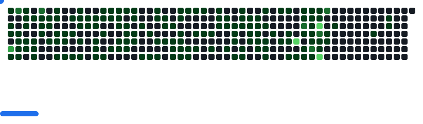

<!--    -->
  

<!-- https://cdn3.emoji.gg/emojis/1261-hackerbongocat.gif -->

<h1 align="center">Hi, I'm Maulik Sharma</h1>
<h3 align="center">Student | Coder | Gamer</h3>

<!--
 -->
<!--    -->
<!-- 
 -->

  

<!-- --- -->

## 🔍 About Me

<table align="center">
<tr>
<td width="60%">

- Building web applications using **React.js**
- Exploring **Blockchain based solutions**
- Interested in building scalable, automation-first solutions
- Open to freelance, internships and collaborative projects

📩 Reach me at: **sharmamaulik95@gmail.com**

</td>
<td align="center">
 
## 🌐 Connect with Me

&nbsp;&nbsp;

</td>
</tr>
</table>

---

## 💻 Tech Stack

                

---

## 📊 GitHub Stats

<table align="center">
  <tr>
    <td align="center">
      
    </td>
    <td align="center">
      
    </td>
  </tr>
  
  <tr>
    <td align="center" colspan="2">
      
    </td>
  </tr>
 
</table>

  <picture>
    <source media="(prefers-color-scheme: dark)"  srcset="images/breakout-dark.svg" />
    
  </picture>

---

<h3 align="center">Let's collaborate and code some cool stuff.</h3>
